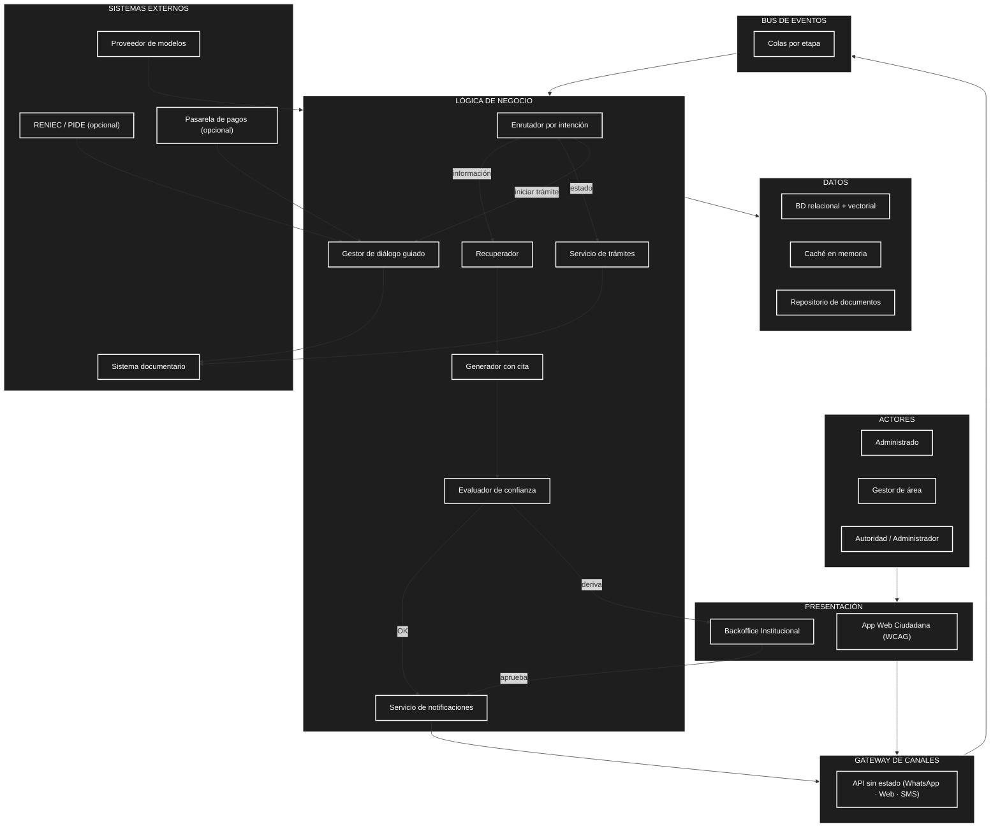

# Asistente virtual para trámites e información administrativa

## Nombre

stella

## Descripción

Asistente virtual académico orientado a orientar, guiar y dar seguimiento a trámites administrativos de una entidad pública peruana con TUPA y mesa de partes.

## Caso de estudio

Se parte de la estructura de WILLAKUY (contexto, contenedores y componentes del worker) y se la adapta de un canal de consultas y reclamos a un asistente que además consulta el estado real del expediente y acompaña al administrado en el inicio de un trámite. Si la entidad es otra, solo cambia el catálogo de trámites.

## Curso

Arquitectura de Software

## Propuesta

La propuesta completa, con contexto, componentes del worker de respuesta, atributos de calidad, riesgos y fases de implementación, se encuentra en:

- [Propuesta del asistente virtual](propuesta.md)

## Documentación del laboratorio (GUIA 02)

La documentación se organiza siguiendo las dos etapas del laboratorio:

### Etapa 1 — Análisis del sistema

- [Actores del sistema](analisis-de-sistema/01-actores.md)
- [Historias de usuario](analisis-de-sistema/02-historias-del-usuario.md)
- [Requisitos funcionales](analisis-de-sistema/03-requisitos-funcionales.md)
- [Atributos de calidad](analisis-de-sistema/04-atributos-de-calidad.md)
- [Restricciones](analisis-de-sistema/05-restricciones.md)
- [Drivers arquitectónicos](analisis-de-sistema/06-driver-arquitectonicos.md)

### Etapa 2 — Diseño arquitectónico inicial

- [Arquitectura inicial (diagrama Mermaid)](arquitectura/arquitectura-inicial.md)
- [Estilo arquitectónico — Workers desacoplados sobre bus de eventos (PASO 4)](arquitectura/estilo-arquitectonico.md)
- [Enfoque arquitectónico — Clean Architecture en el Servicio de Trámites (PASO 5)](arquitectura/enfoque-arquitectonico.md)
- [Código fuente del diagrama](images/arquitectura_sistema.mmd)

## Vista previa del diagrama de arquitectura

