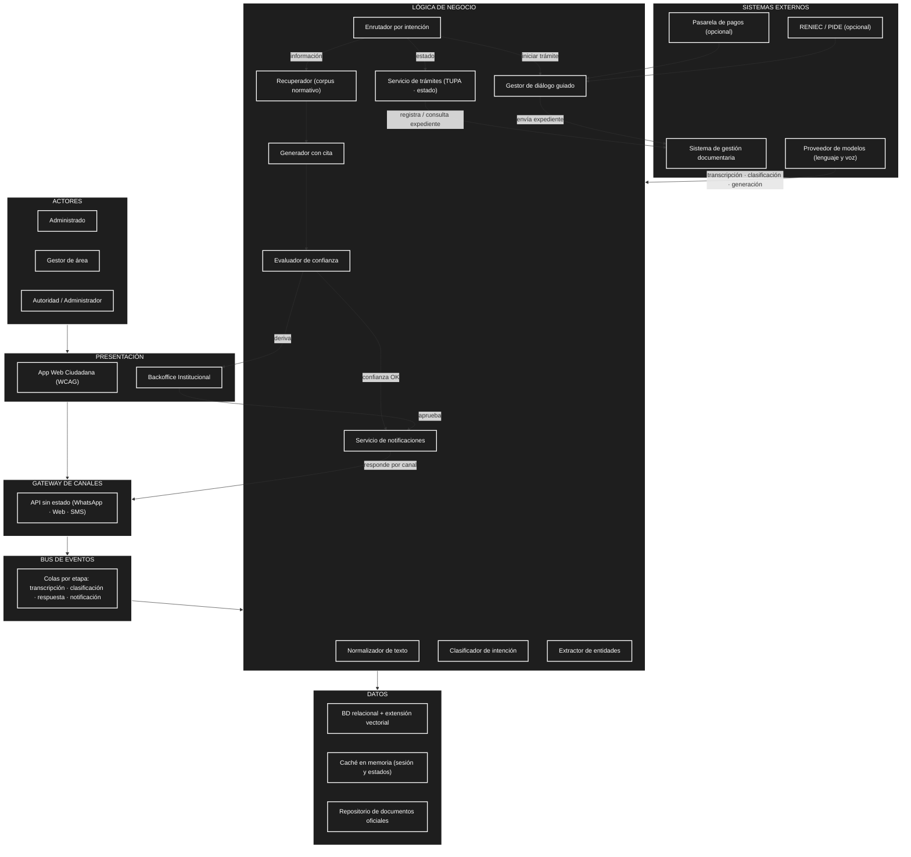

# Arquitectura inicial del sistema

## 1. Arquitectura por capas y contenedores

A partir del análisis del sistema (actores, requisitos, atributos de calidad, restricciones y drivers arquitectónicos), se propone una arquitectura organizada en **capas y contenedores**, inspirada en la estructura de WILLAKUY. Los drivers de exactitud, disponibilidad y privacidad llevan a separar claramente la ingesta, la inferencia, el catálogo de trámites y los datos.

```
┌───────────────────────────────────────────────────────┐
│                       ACTORES                         │
│   Administrado · Gestor de área · Autoridad / Admin   │
└────────────────────────┬──────────────────────────────┘
                         ▼
┌───────────────────────────────────────────────────────┐
│                     PRESENTACIÓN                      │
│  App Web Ciudadana (WCAG) · Backoffice Institucional  │
└────────────────────────┬──────────────────────────────┘
                         ▼
┌───────────────────────────────────────────────────────┐
│                GATEWAY DE CANALES                     │
│       WhatsApp · Web · SMS  →  código en < 200 ms     │
└────────────────────────┬──────────────────────────────┘
                         ▼
┌───────────────────────────────────────────────────────┐
│                   BUS DE EVENTOS                      │
│   colas: transcripción · clasificación · respuesta    │
└────────────────────────┬──────────────────────────────┘
                         ▼
┌───────────────────────────────────────────────────────┐
│               LÓGICA DE NEGOCIO                       │
│                                                       │
│   Normalizador · Clasificador · Extractor              │
│   Enrutador por intención                             │
│   Recuperador · Generador · Evaluador de confianza    │
│   Servicio de trámites · Gestor de diálogo guiado     │
│   Servicio de notificaciones                          │
└────────────────────────┬──────────────────────────────┘
                         ▼
┌───────────────────────────────────────────────────────┐
│                     DATOS                             │
│   BD relacional + extensión vectorial                 │
│   Caché en memoria · Repositorio de documentos        │
└───────────────────────────────────────────────────────┘

Sistemas externos:
  Sistema de gestión documentaria (mesa de partes)
  Proveedor de modelos de lenguaje y voz
  RENIEC / PIDE (opcional) · Pasarela de pagos (opcional)
```

| Capa / Contenedor | Pregunta que responde |
| --- | --- |
| Actores | ¿Quiénes usan el sistema? |
| Presentación | ¿Cómo interactúan el administrado y los gestores? |
| Gateway de canales | ¿Cómo entran y salen los mensajes? |
| Bus de eventos | ¿Cómo desacoplamos la ingesta de la inferencia? |
| Lógica de negocio | ¿Qué hace el asistente y cómo decide? |
| Datos | ¿Dónde se guarda el conocimiento y la trazabilidad? |
| Sistemas externos | ¿Con qué servicios se integra la entidad? |

### Responsabilidades por contenedor

- **Gateway de canales:** API sin estado que recibe mensajes de WhatsApp, web y SMS, valida, encola en el bus y devuelve un código de seguimiento al administrado en menos de 200 ms.
- **Bus de eventos:** desacopla la ingesta de la inferencia con etapas (transcripción, clasificación, respuesta, notificación), de modo que un pico o una caída de un worker no afecta al canal.
- **Workers de procesamiento:** ejecutan la transcripción de voz, la clasificación de intención, la extracción de entidades y la generación de respuesta con recuperación documental. Escalan por separado.
- **Servicio de trámites:** expone el catálogo TUPA estructurado (requisitos, costos, plazos, base legal, área responsable) y consulta el estado real de expedientes en el sistema documentario mediante una capa anticorrupción. Es el camino obligatorio para responder sobre el estado de un expediente, sin pasar por el modelo generativo.
- **Gestor de diálogo guiado:** máquina de estados para flujos como "quiero iniciar el trámite X", que solicita datos, verifica requisitos, adjunta documentos y entrega el expediente prellenado.
- **Servicio de notificaciones:** responde por el canal de origen y avisa al administrado cuando cambia el estado de su expediente.
- **Aplicación web ciudadana:** interfaz accesible (WCAG) con el mismo flujo que el canal conversacional.
- **Backoffice institucional:** bandeja de casos derivados, aprobación de respuestas, edición del catálogo, tablero de demanda y plazos.
- **Almacenamiento:** base relacional con extensión vectorial (catálogo y casos), caché en memoria (sesión y respuestas frecuentes) y repositorio de documentos oficiales.

## 2. Diagrama de arquitectura

El código fuente Mermaid también se encuentra disponible en [`/images/arquitectura_sistema.mmd`](../images/arquitectura_sistema.mmd) para poder reutilizarlo en otros documentos.



## 3. Descripción

La arquitectura inicial se apoya en cuatro ideas clave, derivadas de los drivers arquitectónicos:

- **Ingesta desacoplada:** el gateway de canales y el bus de eventos garantizan que el administrado siempre reciba un acuse rápido, aunque los workers estén saturados o caídos (DA03, DA04).
- **Exactitud sobre fluidez:** las consultas de estado se enrutan directamente al Servicio de trámites y al sistema documentario, sin pasar por el modelo generativo, para evitar alucinaciones sobre expedientes concretos (DA02). Las consultas de información sí pasan por el recuperador y el generador, pero siempre con cita normativa y evaluación de confianza (DA01).
- **Conocimiento versionado:** el catálogo TUPA y el corpus normativo viven en el Servicio de trámites y en el repositorio de documentos, de modo que el gestor de área puede actualizarlos sin desplegar código (DA07).
- **Privacidad por diseño:** los datos personales se enmascaran antes de salir al proveedor externo y la trazabilidad de cada respuesta se persiste en la base relacional (DA05, DA08).