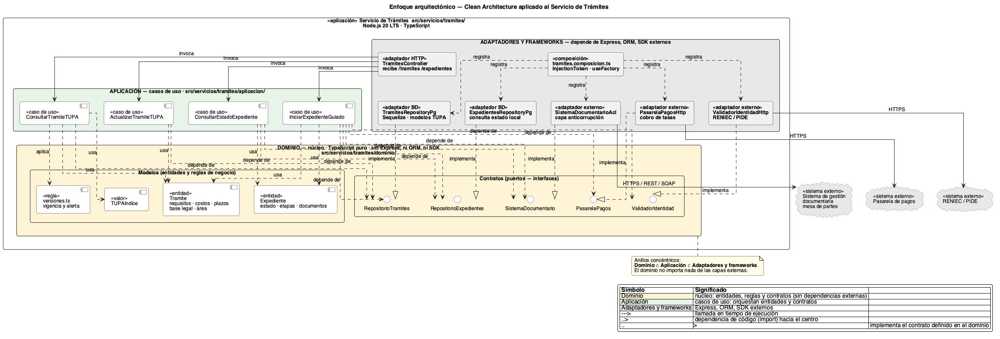

# Enfoque arquitectónico: Clean Architecture aplicado al Servicio de Trámites

> Documento correspondiente al **PASO 5** de la GUIA-003-ASF.
> Define **cómo se organizan internamente** las responsabilidades y dependencias del **Servicio de trámites**, el componente del backend con el dominio más estable (TUPA, Expediente) y el mayor número de integraciones externas (sistema documentario, RENIEC, pasarela de pagos).



## 1. Enfoque seleccionado: **Clean Architecture (Arquitectura Limpia)**

El **Servicio de trámites** se construye aplicando **Clean Architecture**: un enfoque que organiza el sistema alrededor de las **reglas de negocio** y establece que las dependencias del código deben apuntar **hacia el interior**, evitando que el núcleo del negocio dependa de Express, Sequelize, los SDKs externos o cualquier servicio externo (sistema documentario, RENIEC, pasarela de pagos).

### Objetivo

Separar responsabilidades y controlar las dependencias hacia el dominio, para que las reglas del TUPA y de los expedientes sean independientes de la tecnología.

### ¿Qué problema resuelve?

Evita el acoplamiento entre la API HTTP, las reglas de negocio (vigencia del TUPA, transición de estados del expediente, validaciones) y los sistemas externos (mesa de partes, RENIEC, pasarela de pagos).

## 2. Estructura de capas

El Servicio de trámites se divide en **cuatro capas concéntricas** dentro de `src/servicios/tramites/`:

| Capa                | Ruta                                       | Responsabilidad                                                                                          | Ejemplos                                                                                                                                                                                              |
| ------------------- | ------------------------------------------ | -------------------------------------------------------------------------------------------------------- | ----------------------------------------------------------------------------------------------------------------------------------------------------------------------------------------------------- |
| **Dominio**         | `src/servicios/tramites/dominio/`          | Núcleo. Entidades, objetos de valor, reglas del TUPA y de los expedientes. **No importa nada externo.**  | `Tramite`, `Expediente`, `TUPAIndice`, `versiones.ts` (vigencia y alertas), contratos (`RepositorioTramites`, `RepositorioExpedientes`, `SistemaDocumentario`, `ValidadorIdentidad`, `PasarelaPagos`). |
| **Aplicación**      | `src/servicios/tramites/aplicacion/`       | Casos de uso. Orquestan entidades y contratos.                                                           | `ConsultarTramiteTUPA`, `ConsultarEstadoExpediente`, `IniciarExpedienteGuiado`, `ActualizarTramiteTUPA`.                                                                                              |
| **Adaptadores y frameworks** | `src/servicios/tramites/adaptadores/`   | Implementan los contratos y exponen la API. Aquí sí aparece Express y Sequelize.                         | `TramitesController` (HTTP), `TramitesRepositoryPg`, `ExpedientesRepositoryPg`, `SistemaDocumentarioAcl` (capa anticorrupción), `ValidadorIdentidadHttp`, `PasarelaPagosHttp`, `tokens.ts`.            |
| **Composición**     | `src/servicios/tramites/tramites.composicion.ts` | Único archivo donde se decide qué adaptador cumple cada contrato (`useFactory` + `InjectionToken`). | `bind(REPOSITORIO_TRAMITES).to(TramitesRepositoryPg)`, etc.                                                                                                                                          |

**Anillos concéntricos:** Dominio ⊂ Aplicación ⊂ Adaptadores y frameworks.

## 3. Raíz de composición

Archivo único: `src/servicios/tramites/tramites.composicion.ts`.

Es el **único archivo de todo el Servicio de trámites** donde se decide qué adaptador cumple cada contrato, mediante `useFactory` + `InjectionToken`.

```ts
// Ejemplo: alternar entre el adaptador real y un adaptador en memoria
container.bind(REPOSITORIO_TRAMITES).to(TramitesRepositoryPg);
// container.bind(REPOSITORIO_TRAMITES).to(TramitesRepositoryMemoria); // tests
```

Cambiar de proveedor se resume en editar esa línea; ni el dominio ni los casos de uso se enteran.

## 4. Sistema externo (visto desde el Servicio de trámites)

El Servicio de trámites es el **punto de contacto con el exterior** y aísla al resto del backend de los cambios en sistemas externos. Su capa anticorrupción se documenta en [`../estilo-arquitectonico.md`](../estilo-arquitectonico.md):

| Sistema externo                              | Adaptador (puerto → adaptador)                                |
| -------------------------------------------- | -------------------------------------------------------------- |
| Sistema de gestión documentaria / mesa de partes | `SistemaDocumentario` (puerto) ← `SistemaDocumentarioAcl` (capa anticorrupción). |
| RENIEC / PIDE (opcional)                     | `ValidadorIdentidad` (puerto) ← `ValidadorIdentidadHttp`.      |
| Pasarela de pagos (opcional)                 | `PasarelaPagos` (puerto) ← `PasarelaPagosHttp`.                |
| PostgreSQL con extensión vectorial           | `RepositorioTramites` / `RepositorioExpedientes` ← adaptadores `*RepositoryPg` (Sequelize). |

## 5. Reglas del enfoque (Clean Architecture)

1. **El dominio no importa nada de las capas externas.** Ni `express`, ni `sequelize`, ni SDKs de RENIEC o de la pasarela de pagos.
2. **Los casos de uso solo conocen entidades y contratos.**
3. **Los adaptadores implementan contratos y son intercambiables.**
4. **La capa anticorrupción traduce el modelo externo al modelo interno.** Si el sistema documentario cambia, solo se modifica `SistemaDocumentarioAcl`.
5. **Cambiar de tecnología = cambiar `tramites.composicion.ts` y los adaptadores, no el dominio.**

Estas reglas se verifican ejecutando el Servicio de trámites **sin Express ni Sequelize** (cargando solo `dominio/`, `aplicacion/` y los adaptadores en memoria). Si alguna de esas capas importara `express` o `sequelize`, la carga fallaría.

## 6. Beneficios

- **Mantenibilidad** (AC07): el dominio del TUPA y del expediente se modifica sin tocar HTTP ni SQL.
- **Testabilidad**: las reglas de vigencia, transición de estados y validaciones se ejecutan en milisegundos sin servidor ni base de datos.
- **Interoperabilidad** (AC09): pasar del sistema documentario A al sistema B solo requiere cambiar `SistemaDocumentarioAcl`.
- **Privacidad** (AC05): el enmascarado del DNI se aplica en el adaptador del proveedor, fuera del dominio; el resto del sistema nunca ve el dato en claro.
- **Trazabilidad** (AC06): cada caso de uso registra su entrada, su resultado y la versión del documento citado, sin acoplarse al esquema del sistema documentario.

## 7. Leyenda del diagrama

| Símbolo                    | Significado                                                                 |
| -------------------------- | --------------------------------------------------------------------------- |
| Flecha sólida →            | Llamada en tiempo de ejecución (control).                                   |
| Flecha discontinua - - - > | Dependencia de código (`import`): siempre apunta hacia el centro (dominio). |
| Flecha violeta - - - ▷     | Implementa el contrato definido en el dominio (inversión de dependencia).   |

## 8. Relación con el estilo arquitectónico (PASO 4)

| Nivel                                | Documento                                                  | Pregunta que responde                                                          |
| ------------------------------------ | ---------------------------------------------------------- | ------------------------------------------------------------------------------ |
| **Estilo arquitectónico** (PASO 4)   | [`../estilo-arquitectonico.md`](../estilo-arquitectonico.md) | ¿Cómo se organiza, se comunica y se despliega **globalmente** el backend?     |
| **Enfoque arquitectónico** (PASO 5)  | Este documento                                             | ¿Cómo se organiza **internamente** el Servicio de trámites (responsabilidades y dependencias)? |
