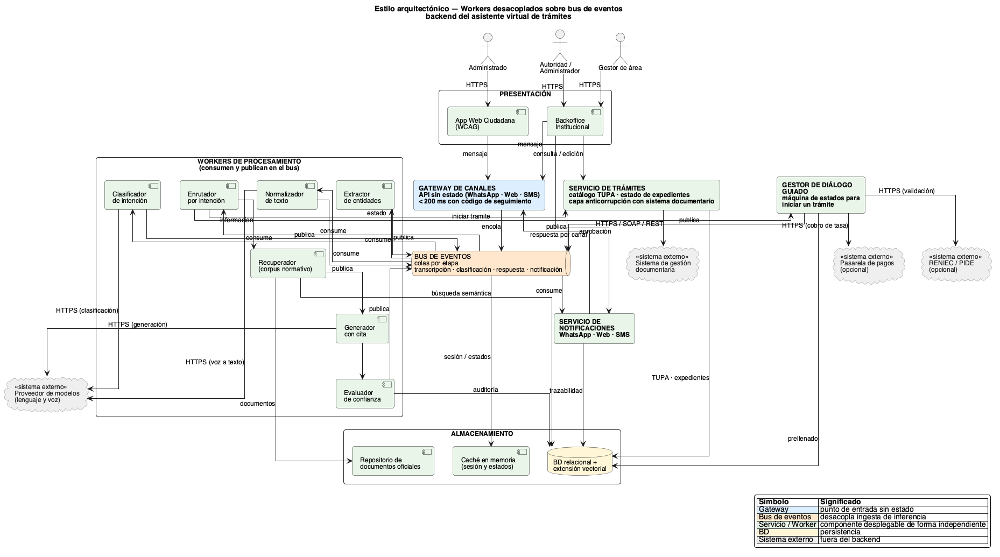

# Estilo arquitectónico del sistema

> Documento correspondiente al **PASO 4** de la GUIA-003-ASF.
> Define la **forma global** del backend: cómo se organiza, se comunica y se despliega el conjunto de servicios del asistente virtual.

## 1. Estilo seleccionado: **Workers desacoplados sobre un bus de eventos con gateway sin estado**

El backend se construye como un **conjunto de workers y servicios independientes** que se comunican de forma **asíncrona** a través de un **bus de eventos**, accedidos por un **gateway de canales sin estado** que responde al administrado en menos de 200 ms.

- Un **gateway** único que recibe mensajes de todos los canales (WhatsApp, web, SMS) y los encola.
- Un **bus de eventos** con colas por etapa que desacopla la ingesta de la inferencia.
- **Workers** especializados (normalizador, clasificador, extractor, enrutador, recuperador, generador, evaluador de confianza) que consumen y publican en el bus.
- **Servicios de negocio** desacoplados: Servicio de trámites, Gestor de diálogo guiado, Servicio de notificaciones.
- **Almacenamiento** compartido: BD relacional con extensión vectorial, caché en memoria y repositorio de documentos oficiales.

## 2. Componentes del estilo

| Componente                          | Responsabilidad                                                                                    | Tecnología sugerida                          |
| ----------------------------------- | -------------------------------------------------------------------------------------------------- | -------------------------------------------- |
| **Gateway de canales**              | API sin estado. Recibe, valida, encola y devuelve un código de seguimiento en < 200 ms.             | Express / Fastify · sin estado · autenticación por JWT para backoffice. |
| **Bus de eventos**                  | Colas por etapa (transcripción, clasificación, respuesta, notificación). Absorbe picos y caídas.   | RabbitMQ, Redis Streams, Kafka o SQS.        |
| **Workers de procesamiento**        | Normalización, clasificación, extracción, enrutamiento, recuperación y generación con cita.        | Procesos Node.js 20 LTS · escalan por separado. |
| **Servicio de trámites**            | Catálogo TUPA y consulta de estado de expedientes con capa anticorrupción.                        | Node.js · TypeScript · Clean Architecture (ver PASO 5). |
| **Gestor de diálogo guiado**        | Máquina de estados para "quiero iniciar el trámite X": pide datos, valida requisitos y prellena.   | Motor de estados + validaciones.             |
| **Servicio de notificaciones**      | Entrega la respuesta por el canal de origen y avisa cambios de estado del expediente.             | Adaptador por canal (WhatsApp, Web, SMS).    |
| **Almacenamiento**                  | Base relacional + vector, caché en memoria y repositorio de documentos.                            | PostgreSQL + pgvector, Redis, S3 compatible. |
| **Backoffice institucional**        | Bandeja de casos derivados, aprobación de respuestas, edición del catálogo, tablero.               | Aplicación web accesible (WCAG).             |

## 3. Servicios de negocio

| Servicio                | Función                                                                                     | Workers relacionados            |
| ----------------------- | ------------------------------------------------------------------------------------------- | ------------------------------- |
| `gateway`               | Ingesta multi-canal y respuesta inmediata con código de seguimiento.                        | —                               |
| `bus`                   | Colas por etapa con reintentos, DLQ y observabilidad.                                       | Consumidores de cada worker.    |
| `workers/ingesta`       | Normalizador, clasificador de intención, extractor de entidades.                            | Publican eventos en el bus.     |
| `workers/recuperacion`  | Recuperador del corpus normativo, generador con cita, evaluador de confianza.               | Consumidos por el bus.          |
| `servicio-tramites`     | Catálogo TUPA + estado real de expedientes, con capa anticorrupción.                        | Consumido por el enrutador.     |
| `dialogo-guiado`        | Máquina de estados para iniciar un trámite con prellenado.                                  | Disparado por el enrutador.     |
| `notificaciones`        | Envío por canal de origen y avisos de cambio de estado.                                     | Consumido desde el bus.         |
| `backoffice`            | Bandeja, aprobación, edición de catálogo y tablero de demanda.                              | Interfaz administrativa.        |

## 4. Sistemas externos

| Sistema externo                              | Protocolo    | Componente que lo consume                 |
| -------------------------------------------- | ------------ | ----------------------------------------- |
| Sistema de gestión documentaria / mesa de partes | HTTPS / REST / SOAP | `servicio-tramites` (capa anticorrupción) |
| Proveedor de modelos (lenguaje y voz)        | HTTPS / REST | `workers/ingesta` y `workers/recuperacion`|
| RENIEC / PIDE (opcional)                     | HTTPS / REST | `dialogo-guiado`                          |
| Pasarela de pagos (opcional)                 | HTTPS / REST | `dialogo-guiado`                          |

## 5. Reglas del estilo

1. **El gateway es el único punto de entrada** y debe responder en menos de 200 ms; nunca espera a un worker.
2. **Ningún worker llama directamente a otro**: la comunicación es siempre vía bus (publica / consume).
3. **El Servicio de trámites es el único camino para datos de expedientes**; el modelo generativo nunca se usa para inventar estados.
4. **Los workers escalan de forma independiente** según la carga de su etapa (transcripción, clasificación, generación).
5. **Si un worker o un sistema externo cae**, la respuesta cae a degradación controlada (caché, derivación a gestor) sin afectar al gateway.
6. **El backoffice** nunca consulta al gateway; usa sus propios endpoints internos sobre el Servicio de trámites.

## 6. ¿Por qué workers desacoplados sobre un bus de eventos?

La selección se justifica a partir de los drivers arquitectónicos definidos en [`../analisis-de-sistema/06-driver-arquitectonicos.md`](../analisis-de-sistema/06-driver-arquitectonicos.md):

| Driver                       | Aporte a la decisión                                                                                                                                              |
| ---------------------------- | ----------------------------------------------------------------------------------------------------------------------------------------------------------------- |
| DA03 – Gateway < 200 ms / picos | Un gateway sin estado + bus por etapa garantiza respuesta inmediata y absorbe picos sin bloquear al administrado.                                                |
| DA04 – Degradación controlada  | Si el proveedor de modelos o el sistema documentario caen, el bus retiene los mensajes y el sistema entrega respuestas básicas + derivación.                       |
| DA02 – Estados reales          | Enrutar la consulta de estado directamente al Servicio de trámites, sin pasar por el generador, evita alucinaciones sobre expedientes concretos.                    |
| DA01 – Exactitud con cita      | Recuperador y generador con cita normativa explícita; el evaluador de confianza decide entre emitir o derivar.                                                     |
| DA07 – TUPA actualizable       | El catálogo vive en el Servicio de trámites; el gestor lo actualiza sin redesplegar workers.                                                                      |
| DA05 – Privacidad              | El enmascarado se aplica en la frontera del bus antes de salir al proveedor externo; el resto del sistema nunca ve datos personales en claro.                    |
| DA09 – Multicanal              | Un único gateway abstrae WhatsApp, web y SMS; los workers y servicios desconocen el canal.                                                                       |
| DA10 – Accesibilidad WCAG      | La App Web Ciudadana comparte el mismo flujo conversacional que el resto de canales, garantizando la misma UX accesible.                                          |

Un estilo puramente **síncrono** (tipo REST encadenado) se descartó porque cualquier pico o caída de un worker bloquearía al gateway y rompería el SLA de 200 ms. Un **monolito único** se descartó porque la separación entre workers es clave para absorber picos heterogéneos y aislar caídas.

## 7. Leyenda del diagrama

| Símbolo                | Significado                                                                       |
| ---------------------- | --------------------------------------------------------------------------------- |
| `«sistema externo»` (gris) | Componente fuera del backend.                                                |
| `Gateway` (azul)       | Punto de entrada sin estado, fuera del bus.                                       |
| `Bus de eventos` (naranja) | Colas por etapa, desacoplan ingesta de inferencia.                            |
| `Servicio / Worker` (verde) | Componente desplegable de forma independiente.                              |
| `BD` (amarillo)        | Persistencia compartida.                                                          |

## 8. Relación con el enfoque arquitectónico (PASO 5)

El estilo define la **forma global** del backend y la forma en que los **servicios se comunican entre sí**. La forma en que se organiza **internamente** un servicio concreto —en este caso el **Servicio de trámites**, por su dominio claro (TUPA, Expediente) y sus integraciones externas (sistema documentario, RENIEC, pagos)— se describe en [`enfoque-arquitectonico.md`](./enfoque-arquitectonico.md):

- **Estilo arquitectónico (PASO 4)** → workers desacoplados sobre un bus de eventos con gateway sin estado (backend del asistente).
- **Enfoque arquitectónico (PASO 5)** → Clean Architecture aplicado al Servicio de trámites, descrito en [`enfoque-arquitectonico.md`](./enfoque-arquitectonico.md).

Ambos niveles son complementarios: el estilo responde a drivers de disponibilidad, rendimiento y resiliencia; el enfoque responde a drivers de mantenibilidad, testeabilidad e interoperabilidad.
